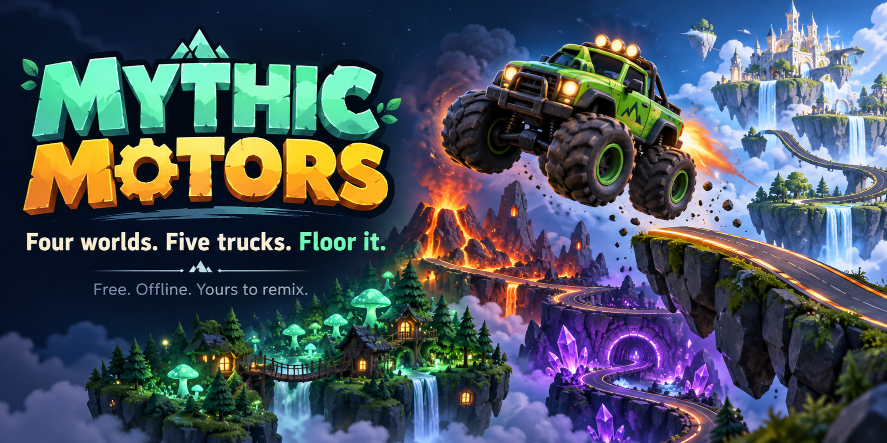
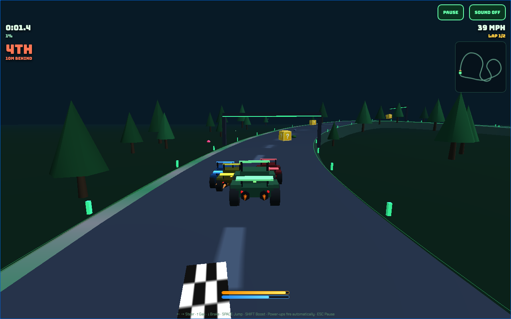

# Mythic Motors



**A small, complete 3D racing game with very large tires.** Race three rivals through a glowing forest, a volcanic forge, crystal caverns, and a floating sky citadel. Jump the gaps, catch a boost, and see what comes out of the next mystery box.

**[Play now](https://jessemaddox.com/projects/monster-truck/game/)** · **[Download the offline game](https://github.com/jessecmaddox3/mythic-motors/releases/latest/download/Mythic-Motors.html)**

I built this for my own personal use, around the kind of game I wanted to play. Make it your own, and feel free to improve mine. Hopefully it gives you a useful starting point, or at the very least some ideas. Cheers!

## Start in a minute

1. Press **Play now** above. On a computer, you can also download **Mythic-Motors.html**, save it, and double-click it to open it in your browser.
2. Press **RACE**, choose a track, pick rival difficulty, and choose a truck. All five trucks are available from the start.
3. Wait for the countdown, then drive. Each race is two laps.

No account, installation, terminal, internet connection, or AI subscription is needed for the downloaded file. It includes the game, 3D library, fonts, and license notices. If the file opens as text, right-click it, choose **Open with**, and select your browser. On phones, the Play now link is usually easier.

The game needs WebGL graphics support. If your browser cannot start graphics, the game shows setup help. A laptop or desktop is the easiest place to start; phones have touch controls too.

## Drive

| Action | Keyboard | Touch |
| --- | --- | --- |
| Accelerate / brake | Up / Down arrows | ▲ / BRK |
| Steer | Left / Right arrows | ◄ / ► |
| Jump | Space | JMP |
| Boost | Shift | Flame button |
| Pause | Escape, or Pause | Pause |

Mystery boxes automatically activate their power-up: a rocket, a blaster, or a jetpack. Boost and jump meters recharge while you're on the ground. Build speed before a chasm; falling returns you to the approach for another try.

Use **Sound on/off** to control the procedural audio. Switching away pauses an active race, clears held controls, and waits for you to press **Resume**. The countdown and delayed blaster shots pause too.

Best times are kept **for this open session only**, per track. Reloading or closing the game clears them. There is no account, saved career, online leaderboard, or analytics in this game.

## The full game is here

- Four themed tracks, preview maps, five trucks with different handling stats, and three rival difficulties.
- Acceleration, braking, steering, corner drift, wall bounces, ramps, chasms, boost and jumping.
- Three AI rivals, a minimap, two-lap races, placement, finish times, star ratings and session bests.
- A shuffled power-up bag, blaster projectiles, a rocket and a jetpack.
- Procedural scenery, truck models, animated exhaust, chase camera and synthesized sounds.

The public release preserves the original game and improves control cancellation, pausing, delayed-effect cleanup, time formatting, keyboard selection, and graphics failure messages. [Design notes](docs/design.md) explain how it works and where you can change it.



Actual gameplay above. The README hero is an illustration generated with ChatGPT, not a screenshot. The game uses simple procedural geometry. See [art and source provenance](docs/provenance.md).

## Make it yours

The original code and documentation use the [MIT license](LICENSE). Use, change, share, or sell your version, keeping the notice. Three.js and the fonts retain their [own licenses](THIRD_PARTY_NOTICES.md).

To get the source without Git, click GitHub's green **Code** button, choose **Download ZIP**, and unzip it. You can open `public/index.html` directly to play. To edit the game, start with:

- `public/game.js`: tracks, trucks, driving, rivals, power-ups and lifecycle.
- `public/game.css`: visual styling and responsive controls.
- `public/index.html`: menus, HUD and buttons.

If you prefer a local development server, install Node.js 22 or newer, open a terminal in the project folder, and run:

```sh
npm start
```

Open the address printed in that terminal. Press **Ctrl+C** to stop the server. There are no packages to install. To make your own complete offline file:

```sh
npm run build
```

The result is `artifacts/Mythic-Motors.html`. Host the `public/` folder for a browser version. If you use an AI coding assistant, give it [the adaptation skill](skills/adapt-mythic-motors/SKILL.md) and describe your change.

## Checks and contributions

```sh
npm test
npm run build
python3 scripts/test-browser.py
```

The browser check needs Python Playwright 1.58.0 and its Chromium browser. It uses only the offline file and blocks network requests. See [verification](docs/verification.md) for the actual tested scope and limitations.

Ideas, bug reports and code changes are welcome. Useful starting points include clearer controls, broader browser testing, or new tracks that keep the existing game working. [Contribution guide](CONTRIBUTING.md).
